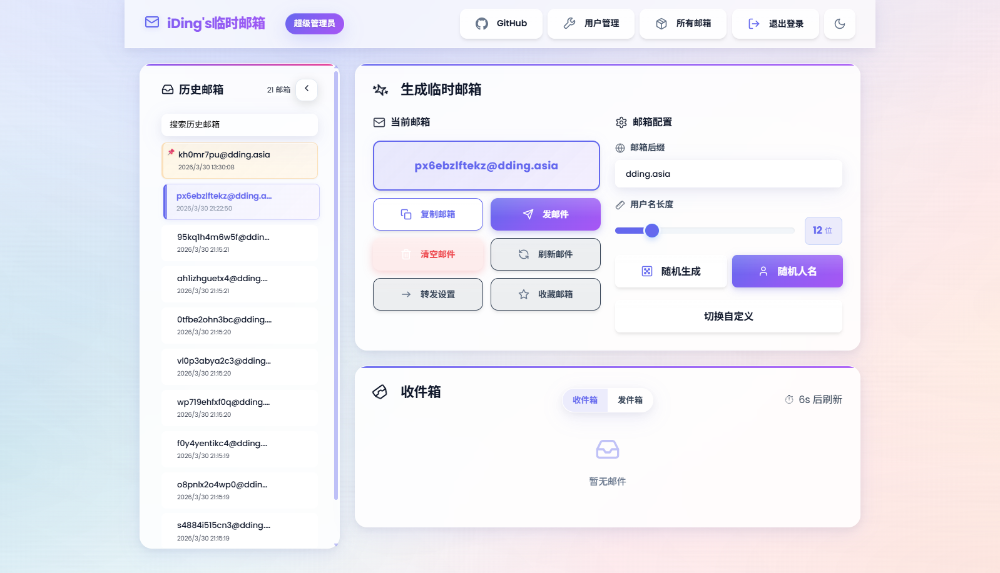
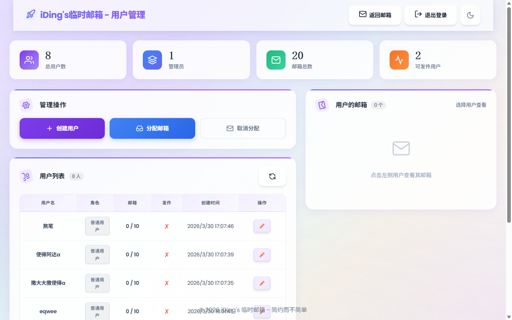
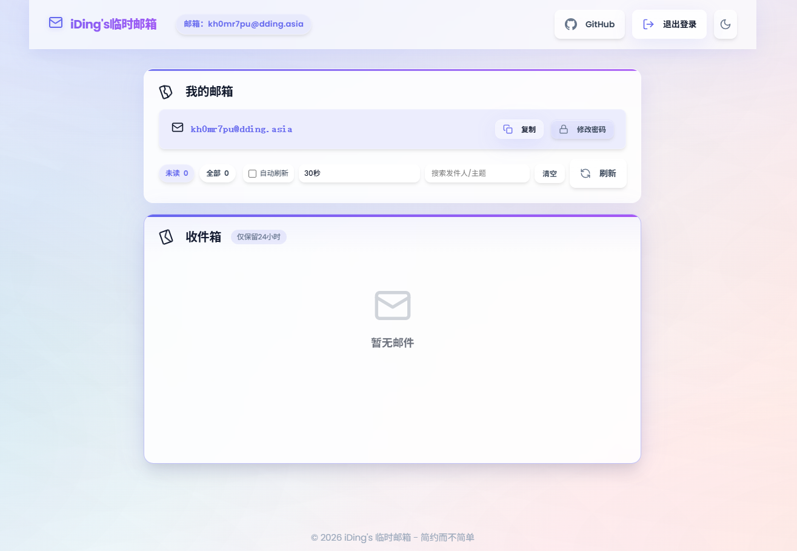
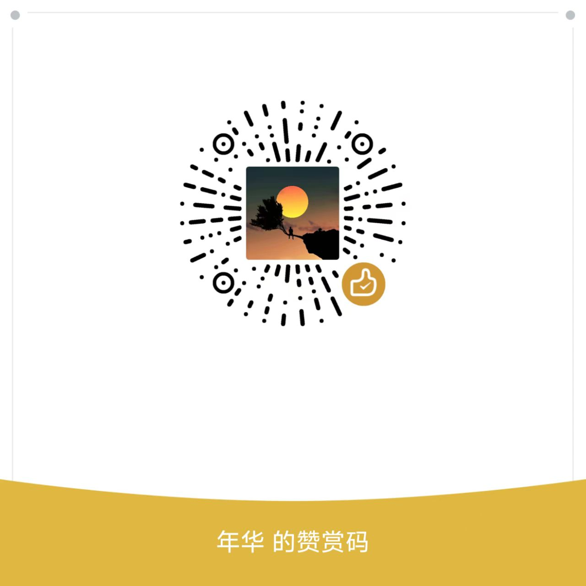

# Freemail - 临时邮箱服务

[](https://deploy.workers.cloudflare.com/?url=https://github.com/idinging/freemail)

🇨🇳 中文 | 🌐 [English](README_en.md)

一个基于 Cloudflare Workers + D1 + R2 构建的前后端分离的**开源临时邮箱服务**，支持 RESTful API 调用，适配多渠道发件，支持邮件接收、发送、转发、用户管理等功能。

**当前版本：V5.3.1** - 新增 Cyberpersons 发件渠道，按发件人域名自动路由 Resend / SendFlare / Cyberpersons

`本邮箱服务支持接收邮件时自动创建对应的邮箱，邮箱服务的转发目标邮箱地址需要在cloudflare Email Addresses中验证`

📖 **[一键部署指南](docs/yijianbushu.md)** | 🤖 **[Github Action 部署指南](docs/action-deployment.md)** | 📬 **[Resend 发件配置](docs/resend.md)** | 🚀 **[SendFlare 发件配置](docs/sendflare.md)** | ☁️ **[Cyberpersons 发件配置](docs/cyberpersons.md)** | 📚 **[API 文档](docs/api.md)**

## 📸 项目展示
### 体验地址： https://freemail.cq.de5.net

### 体验账号： guest
### 体验密码： guest
### 页面展示

| 首页 | 所有邮箱 |
|------|----------|
|  |  |

| 用户管理 | 单个邮箱登录 |
|----------|----------|
|  |  |

[浅色模式展示](docs/zhanshi-light.md) | [深色模式展示](docs/zhanshi-dark.md)

## 功能特性

| 类别 | 特性 |
|------|------|
| 📧 **邮箱管理** | 随机生成临时邮箱 · 多域名支持 · 置顶/收藏 · 历史记录 · 邮箱搜索 |
| 💌 **邮件功能** | 实时接收 · 自动刷新 · 验证码智能提取 · HTML/纯文本 · 邮件转发 |
| ✉️ **发件支持** | 多渠道发件（Resend / SendFlare / Cyberpersons）· 按域名自动路由|
| ⚡ **技术架构** | Cloudflare Workers · D1 数据库 · R2 存储 · Email Routing |


## 版本历史

| 版本 | 主要更新 |
|------|----------|
| **V5.3.1** | 新增 Cyberpersons（CyberPanel Email Delivery）发件渠道|
| **V5.3.0** | 发件模块抽象为 `src/email/providers/` · 新增 SendFlare 渠道· 按发件人域名自动路由 · `sent_emails` 表新增 `provider` 字段 |
| **V5.2.0** | 引入 postal-mime 改进邮件解析 · 修复部分客户端中文乱码问题 |
| **V5.1.0** | 邮箱别名规范化支持扩展，支持 `.` `+` `-` 三种分隔符切分 |
| **V1.0~v4.0** | 邮箱生成 · 邮件接收 · 验证码提取  · 用户管理后台 · R2 存储 EML |

## 部署配置

### 快速开始

1. **一键部署**：点击顶部按钮，按照 [部署指南](docs/yijianbushu.md) 完成配置
2. **配置邮件路由**（收件必需）：域名 → Email Routing → Catch-all → 绑定 Worker
3. **配置发件**（可选）：参考 [Resend 配置教程](docs/resend.md)、[SendFlare 配置教程](docs/sendflare.md) 或 [Cyberpersons 配置教程](docs/cyberpersons.md)，三者可同时启用

> 使用 Git 集成部署时，请在 Workers → Settings → Variables 中手动配置环境变量

### 本地运行

本地运行适合调试前端页面、管理接口和发件逻辑。真实收信依赖 Cloudflare Email Routing，仍需要部署到 Cloudflare Workers 后才能完整验证。

1. **安装依赖**

```bash
npm install
```

2. **配置本地变量**

按需修改 `wrangler.toml` 中的 `[vars]`、D1 和 R2 绑定。至少建议设置：

```toml
ADMIN_NAME = "admin"
ADMIN_PASSWORD = "your_admin_password"
JWT_TOKEN = "your_random_jwt_secret"
MAIL_DOMAIN = "example.com"
```

3. **初始化本地 D1 数据库**

```bash
npx wrangler d1 execute maill_free_db --local --file=./d1-init.sql
```

如果你修改了 `wrangler.toml` 中的 `database_name`，请把上面的 `maill_free_db` 替换为你的数据库名称。

4. **启动本地开发服务**

```bash
npx wrangler dev
```

启动后访问 Wrangler 输出的本地地址即可。默认管理员账号为 `admin`，密码使用 `ADMIN_PASSWORD`。

### 环境变量

| 变量名 | 说明 | 必需 |
|--------|------|------|
| TEMP_MAIL_DB | D1 数据库绑定 | 是 |
| MAIL_EML | R2 存储桶绑定 | 是 |
| MAIL_DOMAIN | 邮箱域名，多个用逗号分隔 | 是 |
| ADMIN_PASSWORD | 严格管理员密码 | 是 |
| ADMIN_NAME | 严格管理员用户名（默认 `admin`） | 否 |
| JWT_TOKEN | JWT 签名密钥 | 是 |
| RESEND_API_KEY | Resend 发件密钥，支持多域名配置 | 否 |
| SENDFLARE_API_KEY | SendFlare 发件密钥，格式同 Resend | 否 |
| CYBERPERSONS_API_KEY | Cyberpersons 发件密钥，格式同 Resend | 否 |
| FORWARD_RULES | 邮件转发规则 | 否 |

<details>
<summary><strong>RESEND_API_KEY / SENDFLARE_API_KEY / CYBERPERSONS_API_KEY 配置格式</strong></summary>

三个渠道密钥都支持相同的三种格式：

```bash
# 单密钥（通配所有发件域名）
RESEND_API_KEY="re_xxxxxxxxxxxxxxxxxxxxxxxx"
SENDFLARE_API_KEY="live_xxxxxxxxxxxxxxxxxxxxxxxx"
CYBERPERSONS_API_KEY="sk_lera_xxxxxxxxxxxxxxxxxxxxxxxx"

# 键值对格式（推荐，多域名独立计费 / 限额）
RESEND_API_KEY="domain1.com=re_key1,domain2.com=re_key2"
SENDFLARE_API_KEY="domain3.com=live_key3"
CYBERPERSONS_API_KEY="domain4.com=sk_live_key4"

# JSON格式
RESEND_API_KEY='{"domain1.com":"re_key1","domain2.com":"re_key2"}'
```

**渠道路由规则**（三个渠道都配置时）：

1. SendFlare 键值对/JSON 命中发件人域名 → 走 SendFlare
2. Resend 键值对/JSON 命中 → 走 Resend
3. Cyberpersons 键值对/JSON 命中 → 走 Cyberpersons
4. SendFlare 单密钥兜底 → 走 SendFlare
5. Resend 单密钥兜底 → 走 Resend
6. Cyberpersons 单密钥兜底 → 走 Cyberpersons
7. 均未命中 → 报错「未找到域名对应的发件 API Key」

注意：SendFlare 与 Cyberpersons 暂不支持发件查询、修改 scheduled_at、取消已调度
邮件，相关接口对这两个渠道发出的邮件会返回 400「SendFlare / Cyberpersons 渠道
暂不支持此操作」。
</details>

<details>
<summary><strong>如何接入新的发件渠道</strong></summary>

发件模块已抽象到 `src/email/providers/`，新增渠道通常不需要改动前端或业务路由。适配步骤请参考 [发件渠道适配文档](docs/provider-adapter.md)。
</details>

<details>
<summary><strong>FORWARD_RULES 配置格式</strong></summary>

规则按前缀匹配，`*` 为兜底规则。

⚠️ **重要**：转发目标邮箱必须在 Cloudflare 控制台中验证后才能使用：
1. 进入 Cloudflare 控制台 → 域名 → 电子邮件 → 电子邮件路由
2. 切换到「目标地址」选项卡
3. 点击「添加目标地址」，输入转发目标邮箱
4. 前往目标邮箱收取验证邮件并点击确认链接


```bash
# 键值对格式
FORWARD_RULES="vip=a@example.com,news=b@example.com,*=fallback@example.com"

# JSON格式
FORWARD_RULES='[{"prefix":"vip","email":"a@example.com"},{"prefix":"*","email":"fallback@example.com"}]'

# 禁用转发
FORWARD_RULES="" 或 "disabled" 或 "none"
```
</details>

## 故障排除

<details>
<summary><strong>常见问题</strong></summary>

1. **邮件接收不到**：检查 Email Routing 配置、MX 记录、MAIL_DOMAIN 变量
2. **数据库连接错误**：确认 D1 绑定名为 `TEMP_MAIL_DB`，检查 database_id
3. **登录问题**：确认 ADMIN_PASSWORD 和 JWT_TOKEN 已设置，清除浏览器缓存
4. **界面显示异常**：检查静态资源路径，查看浏览器控制台错误
</details>

<details>
<summary><strong>调试技巧</strong></summary>

```bash
# 本地调试
wrangler dev

# 查看实时日志
wrangler tail

# 检查数据库
wrangler d1 execute TEMP_MAIL_DB --command "SELECT * FROM mailboxes LIMIT 10"
```
</details>

## 注意事项

- **静态资源缓存**：更新后在 Cloudflare 控制台 Purge Everything，浏览器强制刷新
- **R2/D1 费用**：有免费额度限制，建议定期清理过期邮件
- **安全**：生产环境务必修改默认的 `ADMIN_PASSWORD` 和 `JWT_TOKEN`

## 自动部署

本项目支持 GitHub Actions 自动部署到 Cloudflare Workers。详细配置说明请参考 [自动部署指南](docs/action-deployment.md)。

## 感谢贡献者

感谢 [sarsanta](https://github.com/sarsanta) 贡献的 GitHub Actions 自动部署功能！

感谢 [oxygen](https://github.com/daimiaopeng) 贡献的权限越权漏洞及其修复

## Star History

[](https://www.star-history.com/#idinging/freemail&Date)

## 联系方式

- 微信：`iYear1213`

## Buy me a coffee

如果你觉得本项目对你有帮助，欢迎赞赏支持：

<p align="left">
  
  
</p>

## 许可证

Apache-2.0 license
