# 使用 Cyberpersons 发送邮件（密钥获取与配置教程）

本项目支持通过 Cyberpersons（CyberPanel Email Delivery）提供的 API 进行发件（发件箱）。本文档介绍从注册登录、连接 Cloudflare、验证域名到获取 API Key 并在 Cloudflare Workers 中配置的完整流程。

> 环境变量使用 `CYBERPERSONS_API_KEY`，配置方式与 Resend / SendFlare 一致，支持单密钥、键值对和 JSON 三种格式。

## 1. 注册 Cyberpersons 并登录

访问 [Cyberpersons](https://platform.cyberpersons.com/) 注册账户并登录。登录成功后，你会看到已连接的 Cloudflare DNS 和已验证的域名列表：

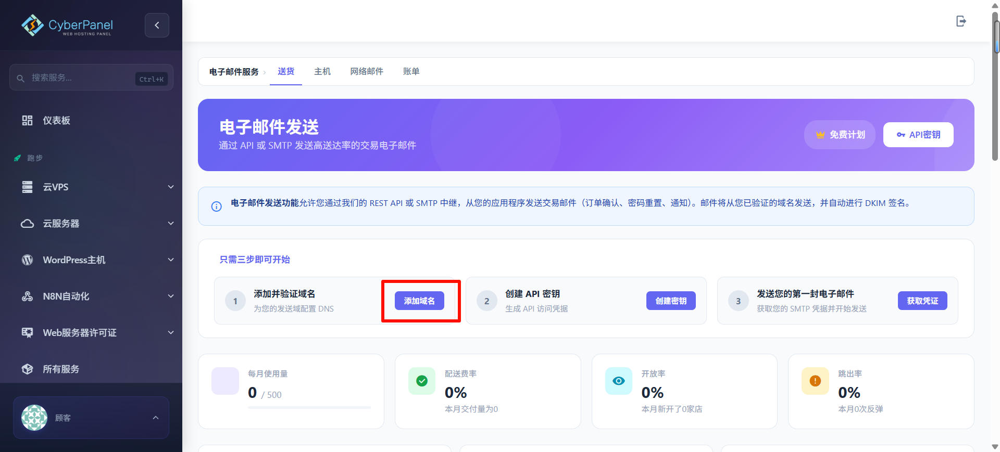

左侧导航栏可以看到 Dashboard、Cloud VPS、Cloud Server 等服务分类，**Email Delivery** 用于管理发件域名。

## 2. 连接 Cloudflare DNS（自动配置）

Cyberpersons 支持通过 Cloudflare API Token 自动配置 SPF、DKIM、DMARC 等 DNS 记录。如果尚未连接，页面会显示 **Not Connected** 状态和输入框：

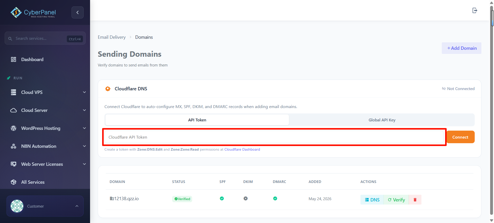

### 2.1 创建 Cloudflare API Token

访问 [Cloudflare API Tokens](https://dash.cloudflare.com/profile/api-tokens)，点击 **+ 创建令牌**：


在模板列表中找到 **编辑区域 DNS**，点击 **使用模板**：

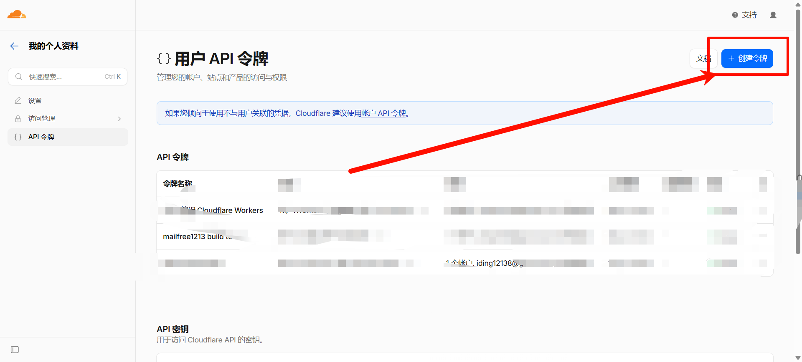

确认权限为「区域 DNS 编辑」：

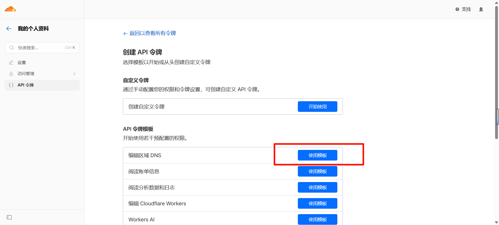

区域资源选择 **所有区域**：


> 其他配置（IP 筛选、TTL 等）保持默认即可。

点击「继续以显示摘要」：

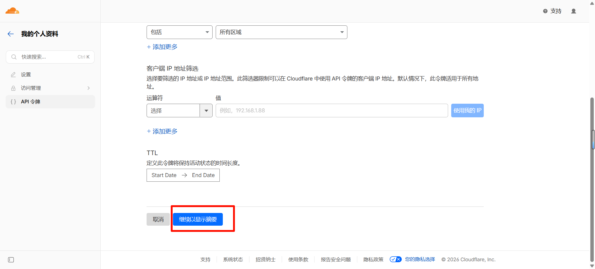

确认后点击「创建令牌」：

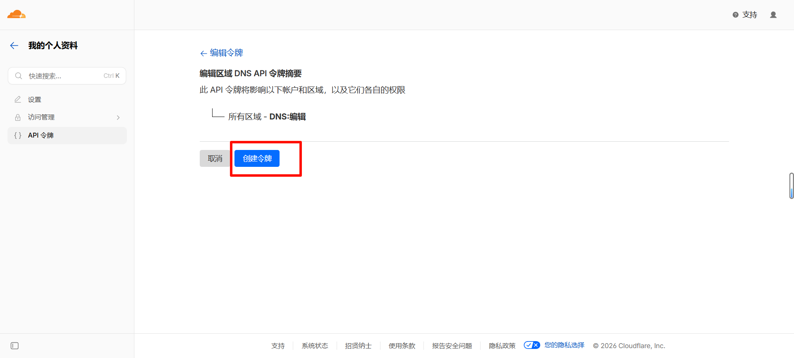

复制生成的 Cloudflare API Token：

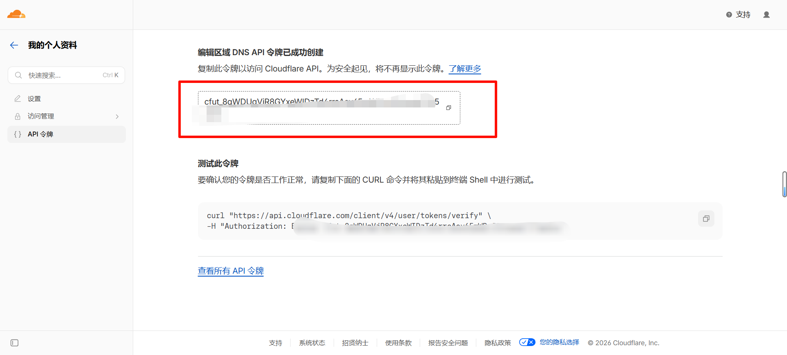

> 此 Token 仅显示一次，请立即复制并妥善保存。

### 2.2 填入 Token 并连接

在 **Cloudflare API Token** 输入框中粘贴上一步生成的 Token，点击 **Connect**：

连接成功后，Cloudflare DNS 区域右上角会显示 **Connected**，并自动管理你账户下所有区域的 DNS 记录：

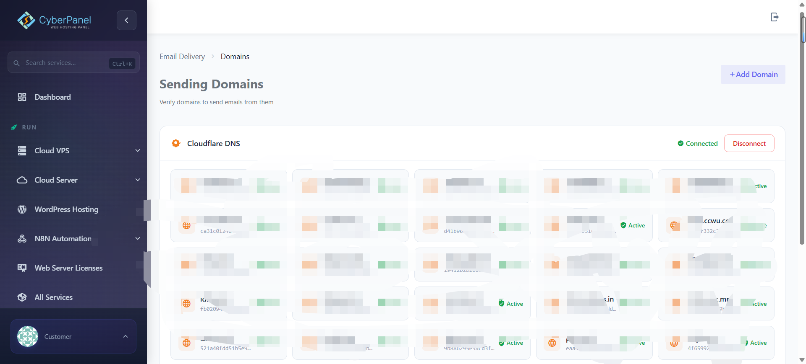

## 3. 添加并验证发件域名

### 3.1 添加域名

点击页面右上角 **+ Add Domain**，在弹出的对话框中输入你要用于发件的域名。DNS 设置方法选择 **Automatic**（因为已通过 Cloudflare API 连接），Cyberpersons 会自动在你的 Cloudflare 区域中添加所需的 SPF、DKIM、DMARC TXT 记录：

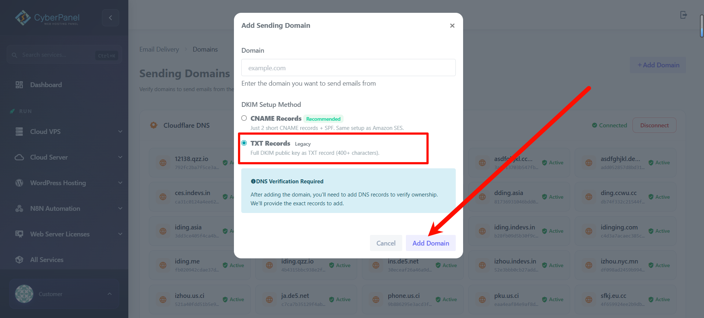

点击 **Add Domain** 提交。

### 3.2 等待验证完成

提交后，Cyberpersons 会开始验证 DNS 记录。等待验证完成后，域名状态会变为 **Active**：

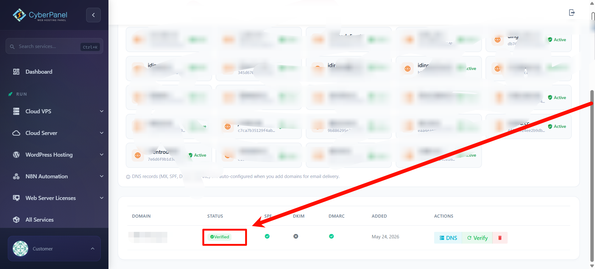

SPF、DKIM、DMARC 列均显示绿色对勾，即表示域名配置完成，可以开始发邮件了。

> 如果需要手动添加 DNS 记录（例如不使用 Cloudflare），可以在添加域名时选择 **Manual** 方式，按照提示的 TXT 记录值到你的 DNS 管理面板中手动添加。

## 4. 获取 Cyberpersons API Key

### 4.1 复制 API Key

创建 API Key 成功后，会弹出提示窗口，强调此 Key **只显示一次**：

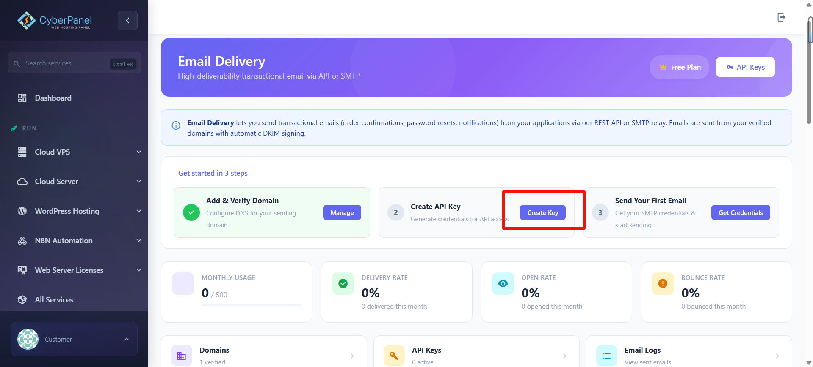

立即点击 **Copy** 复制并妥善保存你的 API Key。点击 "I've Saved My Key" 关闭窗口。

### 4.2 设置 API Key 权限（创建时）

在弹出的创建窗口中，为你的 API Key 填写名称并勾选所需权限：

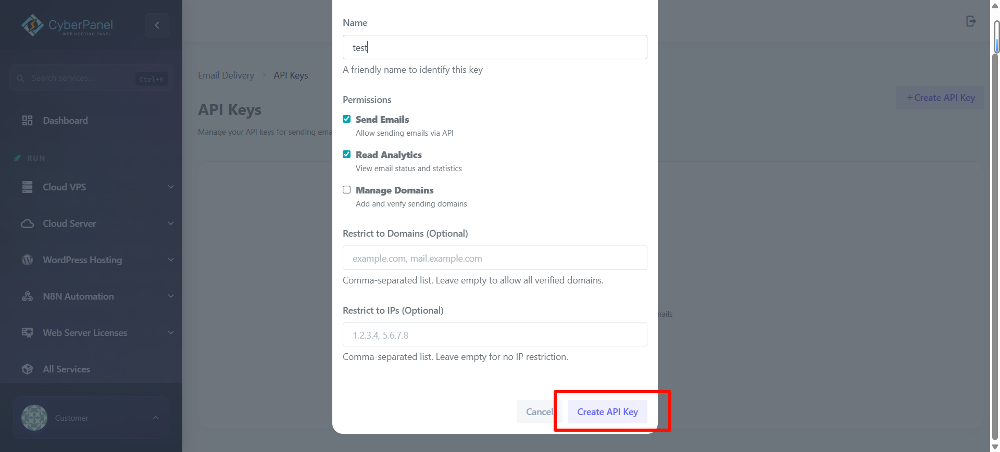

建议勾选：
- **Send Emails**（必需）— 允许通过 API 发送邮件
- **Read Analytics**（可选）— 查看邮件状态和统计数据

其他选项如 **Manage Domains**（管理域名）、**Restrict to Domains**（限制发件域名）、**Restrict to IPs**（限制来源 IP）按实际需求填写。点击 **Create API Key** 提交。

### 4.3 点击创建 API Key

在 **Email Delivery** 面板的 "Get started in 3 steps" 区域，找到第 2 步 **Create API Key**，点击 **Create API Key**：

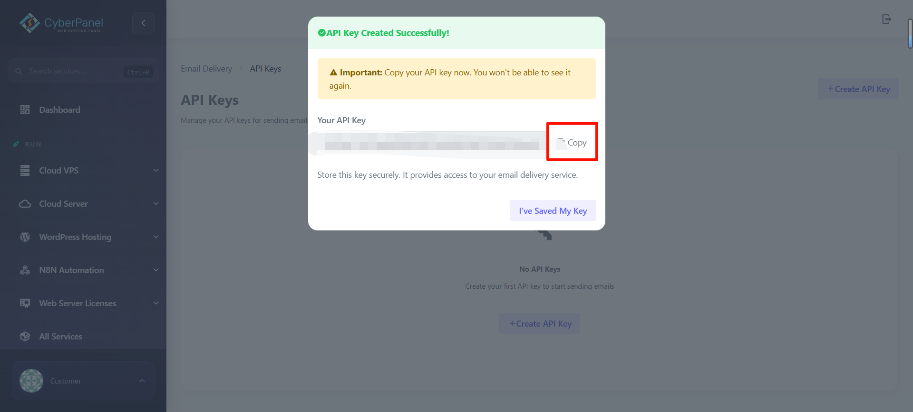

> 该 Key 仅显示一次，丢失后无法找回，只能重新创建新的 Key。

## 5. 在 Cloudflare Workers 配置变量

本项目运行在 Cloudflare Workers，需把密钥配置为 Secret。

方式一：命令行（Wrangler）

```bash
# 设置 Cyberpersons 密钥（Secret）
wrangler secret put CYBERPERSONS_API_KEY

# 设置普通变量（可写入 wrangler.toml 的 [vars]）
# 多域名用逗号分隔
# 例：MAIL_DOMAIN="iding.asia, example.com"
```

方式二：Dashboard（Git 集成部署常用）
- 进入 Cloudflare Dashboard → Workers → 选中你的 Worker → Settings → Variables。
- 在 Secrets 添加 `CYBERPERSONS_API_KEY`。
- 在 Variables 添加 `MAIL_DOMAIN`，值为你用于收取/发件的域名列表（需与 Cyberpersons 已验证域名一致）。

## 6. 关联项目并部署

```bash
# 本地开发
wrangler dev

# 正式部署
wrangler deploy
```

确保 `wrangler.toml` 已绑定 D1 数据库与静态资源（仓库已配置）。

## 7. 前端使用发件功能（发件箱）

- 在首页先生成或选择一个邮箱地址。
- 点击"发邮件"，填写收件人、主题与内容，点击发送。
- 后端会调用 Cyberpersons API 发出邮件，并在数据库记录，前端可在"发件箱"查看记录与详情。

注意：
- 发件地址为当前选中邮箱（形如 `xxx@你的域名`）。你的域名需在 Cyberpersons 已验证。
- 若返回 `未配置 Cyberpersons API Key`，说明没有设置或没有以 Secret 形式提供 `CYBERPERSONS_API_KEY`。

## 8. 常见问题

- 403/Unauthorized：域名未验证或 From 与已验证域名不一致。
- 429/限流：短时间大量请求，稍后重试或开启队列。
- Cloudflare DNS 连接失败：检查 API Token 权限是否包含 Zone DNS Edit 和 Zone DNS Read。
- 中文/HTML 内容：本项目会将 HTML 直接提交给 Cyberpersons，同时自动生成纯文本版本，提升兼容性。

## 9. 相关后端接口

- `POST /api/send` 发送单封邮件
- `GET /api/sent?from=xxx@domain` 获取发件记录列表
- `GET /api/sent/:id` 获取发件详情
- `DELETE /api/sent/:id` 删除发件记录

## 快速参考链接

- [Cyberpersons](https://platform.cyberpersons.com/)
- [Cyberpersons Email Delivery](https://platform.cyberpersons.com/email/delivery/)
- [Cloudflare API Tokens](https://dash.cloudflare.com/profile/api-tokens)
